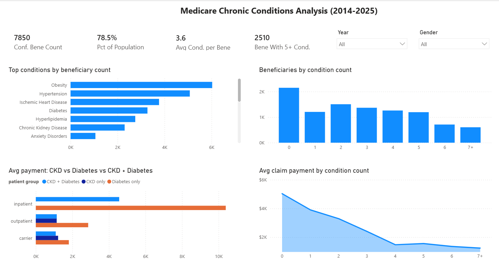

# CMS Medicare Data Warehouse

A portfolio-grade end-to-end data engineering project: ELT pipeline from CMS Synthetic Medicare claims data into a Kimball star schema on PostgreSQL, with a Power BI dashboard focused on chronic condition (CCW) analysis.



---

## Overview

| Item | Detail |
|---|---|
| Source data | CMS Synthetic Medicare (Synthea RIF format) |
| Beneficiaries | ~10,000 synthetic patients, 2014–2025 |
| Raw files | 19 pipe-delimited CSVs (~2.5M claim rows) |
| Database | PostgreSQL 18 |
| Architecture | Three-layer ELT: raw → staging → mart |
| Data model | Kimball star schema |
| Visualization | Power BI Desktop (Import mode) |
| Dashboard | Medicare Chronic Conditions Analysis |

---

## Architecture

```
CMS Synthetic CSVs (19 files)
        |
        v
   [raw schema]          -- TEXT mirror, \COPY load, no transformations
        |
        v
 [staging schema]        -- typed tables, header/line split, safe-cast functions
        |
        v
   [mart schema]         -- Kimball star schema
        |
        v
    Power BI              -- Import mode, DAX measures 
```

### Three-Layer Design

**Raw layer** mirrors all 19 source files as-is with all columns as TEXT. This preserves leading zeros in ZIP/state codes and non-ISO date formats (`DD-Mon-YYYY`) without data loss.

**Staging layer** applies typed transformations via safe-cast helper functions that return NULL on bad input instead of aborting the entire INSERT. Each FFS claim file is split into `*_header` (1 row per `CLM_ID`) and `*_line` (1 row per `CLM_ID × line_num`) tables to prevent fan-traps on payment aggregation.

**Mart layer** implements a Kimball star schema. All seven FFS claim types are unioned into a single `fact_claim_header`. Diagnoses are unpivoted from wide format into long-format `fact_claim_diagnosis` for flexible ICD-10-CM analysis.

---

## Data Model

### Dimensions

| Table | Rows | Description |
|---|---|---|
| `dim_date` | 4,383 | 2014-01-01 to 2025-12-31, `date_key` = YYYYMMDD integer |
| `dim_claim_type` | 7 | FFS claim types with Part A/B flags |
| `dim_beneficiary` | 10,000 | Most recent snapshot per beneficiary (DISTINCT ON) |
| `dim_diagnosis` | 98,488 | ICD-10-CM codes with chapter/block/parent hierarchy |

### Facts

| Table | Rows | Description |
|---|---|---|
| `fact_claim_header` | 555,218 | 1 row per claim, union of 7 FFS types |
| `fact_enrollment` | 86,917 | 1 row per beneficiary × year |
| `fact_claim_diagnosis` | 9,535,901 | Long-format diagnoses (unpivoted from claim headers) |
| `fact_pde` | 515,520 | Prescription drug events |
| `bene_chronic_conditions` | 28,820 | CCW chronic conditions per beneficiary |

### Power BI Helper Tables

| Table | Rows | Purpose |
|---|---|---|
| `bene_condition_count` | 10,000 | Beneficiary distribution by condition count |
| `ckd_diabetes_cost` | ~417,694 | Cost comparison: CKD vs Diabetes vs CKD+Diabetes |

---

## CCW Chronic Conditions

Chronic conditions are derived from ICD-10-CM diagnosis codes using CMS Chronic Conditions Warehouse (CCW) methodology. A condition is confirmed when:

- **Inpatient claims:** at least 1 claim with the relevant ICD prefix
- **Outpatient claims:** at least 2 claims with the relevant ICD prefix

18 conditions are mapped from 44 ICD-10-CM code prefixes.

### Results (all years, all genders)

| Metric | Value |
|---|---|
| Beneficiaries with 1+ confirmed condition | 7,850 (78.5%) |
| Avg confirmed conditions per beneficiary | 3.58 |
| Beneficiaries with 5+ conditions | 2,510 |
| Total claim payments | $1,042,610,858 |

### Top Conditions by Beneficiary Count

| Condition | Confirmed Bene |
|---|---|
| Obesity | 6,028 |
| Hypertension | 5,075 |
| Ischemic Heart Disease | 3,766 |
| Diabetes | 3,273 |
| Hyperlipidemia | 2,754 |
| Chronic Kidney Disease | 2,302 |

---

## Key Engineering Decisions

**All raw columns as TEXT.** CMS dates arrive as `DD-Mon-YYYY` and geographic codes have meaningful leading zeros. TEXT at ingestion preserves everything; typed conversion happens in staging via safe-cast functions.

**Header/line split.** Each FFS claim file repeats header fields on every line row. Without splitting, joining on `CLM_ID` alone causes a fan-trap: `SUM(CLM_PMT_AMT)` is multiplied by the number of line rows. Verified empirically: `SUM(header.clm_pmt_amt) = SUM(line WHERE line_num = 1)`.

**Payment amounts from header only.** `CLM_PMT_AMT` is the correct claim total and exists on every header row. Summing from line items produces inflated totals.

**Single beneficiary staging table.** All 11 annual snapshots are loaded into one `staging.beneficiary` table with `enrollmt_ref_yr` as a column. `dim_beneficiary` selects the most recent snapshot per beneficiary using `DISTINCT ON (bene_id) ORDER BY enrollmt_ref_yr DESC`.

**Long-format diagnoses.** Wide ICD columns (`ICD_DGNS_CD1`–`ICD_DGNS_CD25`) are unpivoted into `fact_claim_diagnosis` for flexible filtering and CCW logic without complex CASE expressions.

**ICD-10-CM from pip package.** The `simple-icd-10-cm` package provides 98,466 unique codes with full hierarchy. 22 Synthea-specific non-standard codes (ICD-10-PCS codes and suffix-less variants) are added manually to reach 100% coverage.

**2025 flagged as partial year.** The 2025 beneficiary snapshot covers only January–March (Part A). All 2025 rows in `fact_enrollment` have `is_partial_year = TRUE`.

---

## Scripts

Scripts are numbered to reflect execution order.

### Raw layer (`sql/raw/`)

| Script | Purpose |
|---|---|
| `01_raw_ddl.sql` | Create all 19 raw tables and load via `\COPY` |
| `02_raw_qa.sql` | Validate row counts, BENE_ID integrity, date formats |

### Staging layer (`sql/staging/`)

| Script | Purpose |
|---|---|
| `03_staging_functions.sql` | Safe-cast helper functions (`safe_to_date`, `safe_to_numeric`, `safe_to_int`, `clean_text`) |
| `04_staging_beneficiary.sql` | Transform 11 beneficiary snapshots into one typed table |
| `05_staging_claims_header_line.sql` | Header/line split for all 7 FFS claim types |
| `06_staging_pde.sql` | Transform prescription drug events |
| `07_staging_qa.sql` | Validate staging: row counts, orphan lines, financial totals |

### Mart layer (`sql/mart/`)

| Script | Purpose |
|---|---|
| `08_mart_dimensions.sql` | `dim_date`, `dim_claim_type`, `dim_beneficiary` |
| `09_mart_facts.sql` | `fact_enrollment`, `fact_claim_header`, `fact_claim_diagnosis`, `fact_pde` |
| `10_mart_ccw_conditions.sql` | CCW chronic conditions mart (`bene_chronic_conditions`) |
| `11_mart_powerbi_helpers.sql` | Power BI helper tables (`bene_condition_count`, `ckd_diabetes_cost`) |
| `14_mart_dim_diagnosis.sql` | `dim_diagnosis` loaded from ICD-10-CM CSV |

### Python (`python/`)

| Script | Purpose |
|---|---|
| `load_icd10cm.py` | Extract ICD-10-CM codes from `simple-icd-10-cm` package into CSV |

---

## Setup

### Prerequisites

- PostgreSQL 18
- Python 3.9+ with `simple-icd-10-cm`: `pip install simple-icd-10-cm`
- Power BI Desktop (April 2026 or later)
- DBeaver or psql

### Data Source

Data is publicly available from the CMS Open Data Portal no registration required:

**[Synthetic Medicare Enrollment, Fee-for-Service Claims, and Prescription Drug Event](https://data.cms.gov/collection/synthetic-medicare-enrollment-fee-for-service-claims-and-prescription-drug-event)**

This is a Synthea-generated dataset of realistic-but-not-real Medicare claims in CMS RIF format the same structure used in real Medicare research files. Download the ZIP archives, extract, and place all CSV files in `C:/Temp/cms_medicare/`:

- `beneficiary_2015.csv` through `beneficiary_2025.csv`
- `inpatient.csv`, `outpatient.csv`, `carrier.csv`, `dme.csv`, `snf.csv`, `hospice.csv`, `hha.csv`
- `pde.csv`

Files are pipe-delimited (`|`) with a header row.

### Running the Pipeline

```powershell
# Set password (PowerShell syntax)
$env:PGPASSWORD = "postgres"

# Create database
& psql -U postgres -c "CREATE DATABASE cms_medicare;"
& psql -U postgres -d cms_medicare -c "CREATE SCHEMA raw; CREATE SCHEMA staging; CREATE SCHEMA mart;"

# Run scripts in order
& psql -U postgres -d cms_medicare -f sql/raw/01_raw_ddl.sql
& psql -U postgres -d cms_medicare -f sql/raw/02_raw_qa.sql
& psql -U postgres -d cms_medicare -f sql/staging/03_staging_functions.sql
& psql -U postgres -d cms_medicare -f sql/staging/04_staging_beneficiary.sql
& psql -U postgres -d cms_medicare -f sql/staging/05_staging_claims_header_line.sql
& psql -U postgres -d cms_medicare -f sql/staging/06_staging_pde.sql
& psql -U postgres -d cms_medicare -f sql/staging/07_staging_qa.sql

# Generate ICD-10-CM reference file
python python/load_icd10cm.py
# Copy output icd10cm.csv to C:/Temp/cms_medicare/

& psql -U postgres -d cms_medicare -f sql/mart/08_mart_dimensions.sql
& psql -U postgres -d cms_medicare -f sql/mart/09_mart_facts.sql
& psql -U postgres -d cms_medicare -f sql/mart/10_mart_ccw_conditions.sql
& psql -U postgres -d cms_medicare -f sql/mart/11_mart_powerbi_helpers.sql
& psql -U postgres -d cms_medicare -f sql/mart/14_mart_dim_diagnosis.sql
```

---

## Dashboard

The Power BI dashboard ("Medicare Chronic Conditions Analysis") connects to PostgreSQL in Import mode and includes:

- 4 KPI cards: confirmed beneficiary count, % of population, avg conditions per beneficiary, high-risk count (5+ conditions)
- Year and Gender slicers
- Horizontal bar chart: top conditions by beneficiary count
- Column chart: beneficiary distribution by condition count
- Column chart: avg claim payment by condition count (showing ~2.3x cost increase from 1 to 5+ conditions)
- Clustered bar chart: CKD-only vs Diabetes-only vs CKD+Diabetes average payment by claim type

All DAX measures are managed via Tabular Editor 2 in a dedicated `_DAX` table.

---

## Notes

- `dim_date` starts from 2014-01-01 to accommodate one hospice claim dated 2014-11-18 (documented in CMS User Guide).
- The `simple-icd-10-cm` library contains 39 duplicate codes; the Python extraction script deduplicates them before writing to CSV.
- `bene_condition_count.condition_group` is a TEXT column (`'0'`–`'7+'`) with a companion `sort_order` INTEGER column used as "Sort by column" in Power BI to prevent alphabetical mis-sorting.
